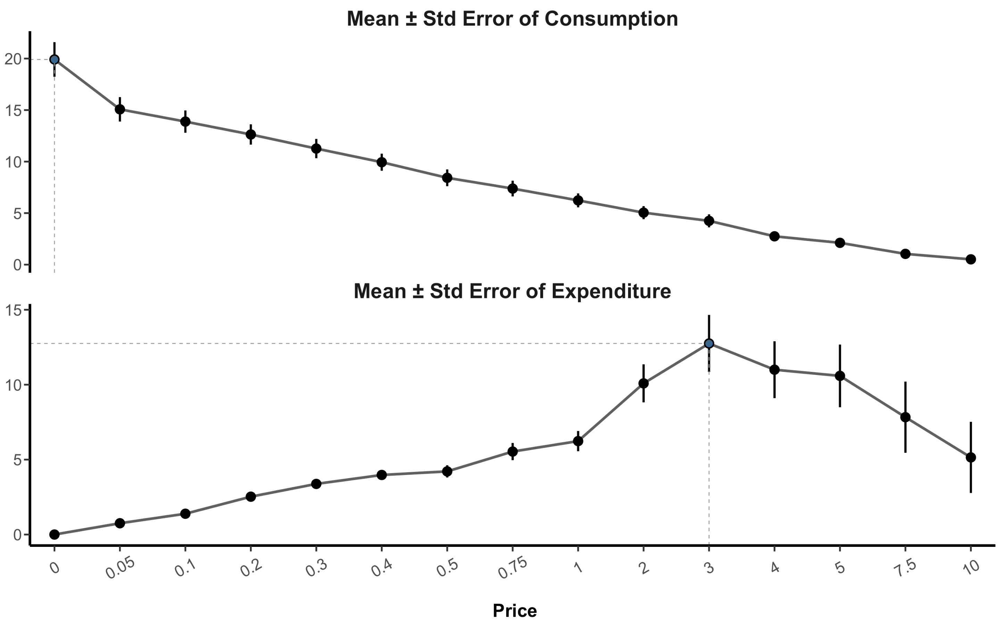
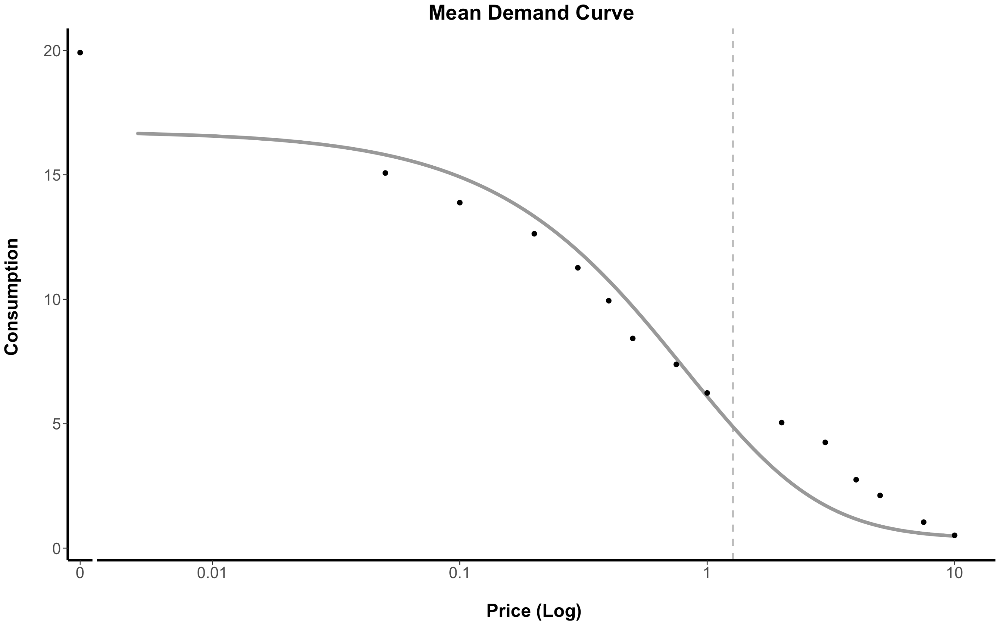
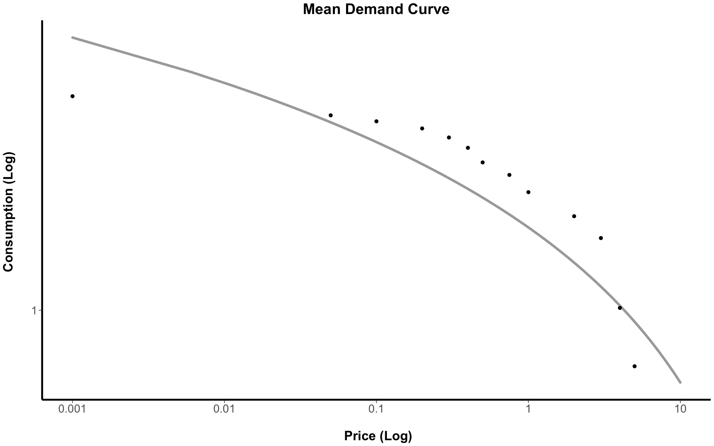
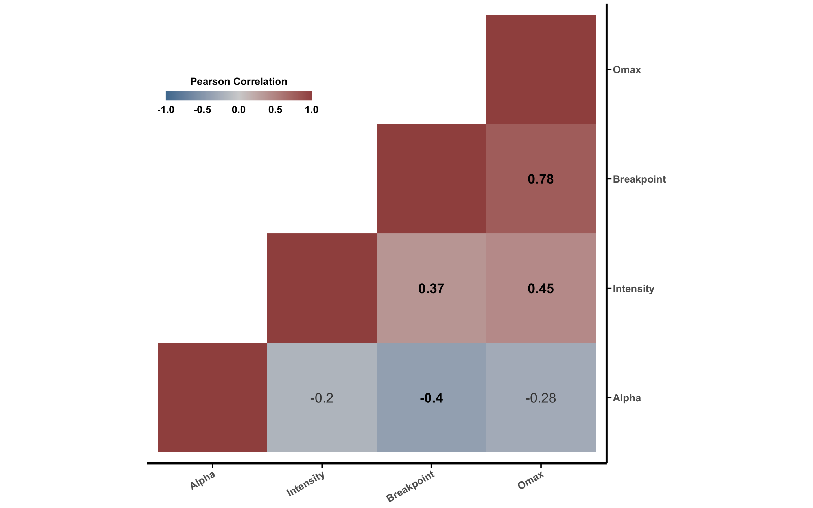

## Version 2.0

This package has undergone a transformation for its pre-release on CRAN. Notable changes include:

a) greater customization regarding quality control and processing; 

b) the ability to process fully- and partially-administered^1 purchase tasks (the latter being administered as an array or until zero consumption is reached)

c) additional functions have been added such as summary descriptives and correlation functions; and

d) the package calculates the empirical purchase task indicators as well as alpha and derived intensity internally.

^1 Although this data processing could be handled in previous versions by assigning zero values to the latter part not administered, the 2.0 version also allows for quality control to be applied to partially-administered purchase tasks.

# The {PThelper} Package

This package is designed to walk users through the various steps required to clean, process, and summarize purchase task data. The benefit of this package is that it provides a standardized framework (see González-Roz et al., 2023 for more information) for processing purchase task data, improving reproducibility. By clearly outlying the steps taken to process purchase task data, the package also lends itself as a learning tool.

The package offers functions for 3 different stages of purchase task processing, plus post-processing descriptives statistics:

i)  The pre-processing stage of the raw data;

ii)  The calculation of empirical indicators and derived indicators via curve-fitting;

iii)  The indicator-level variable management; and

iv) The post-processing stage of data descriptives and summaries

Example Cigarette Purchase Task (CPT) data (`cpt_data`) are provided by this package. Examples using each function in order for typical processing are demonstrated using this data in detail below.

## Installation

To install the {PThelper} package, use the {devtools} package to download directly from this GitHub repository:

```
install.packages("devtools")
devtools::install_github("PBCAR/PThelper")
```

**Check back for an announcement regarding the release of PThelper on CRAN!**

## Introduction to Purchase Tasks

These demand instruments are used to measure the relative reinforcement of a substance - the extent to which a value for a commodity is effected by increased cost. Greater demand (i.e. little sensitivity to changes in price) is often associated with substance-related problems and use disorders (see Bickel et al., 2011). The most commonly used indicators generated from the purchase task are (Murphy & MacKillop, 2006; Gilroy et al., 2020):

Breakpoint -- The first increment of cost with zero consumption

Intensity (Q0 derived) -- Consumption at zero (or negligible) cost

Omax -- The maximum expenditure

Pmax -- The price associated with the maximum total expenditure

Unit Elasticity (derived) -- The price associated with unit elasticity (aligns with Pmax)

Alpha (derived) -- Rate of change constant in consumption relative to price

Eta (derived) -- The % decrease in consumption associated with a 1% increase in price

## i) Pre-Processing

Purchase task processing requires preparation, and using the `price_prep()`, `pt_prep()`, and `pt_qc()` functions will ensure the proper cleaning of the data prior calculating the purchase task indicators.

The `winsor_price()` function is an optional final pre-processing step which offers different outlier management techniques for the price-level data, prior to curve-fitting and other purchase task processing.

The `plot_summary()` function can be used at the end of the pre-processing stage to visualize the consumption and expenditure across the prices of the purchase task, prior to any outlier management. It can also be used to plot consumption and expenditure by a grouping variable.

### price_prep()

This function helps users to rename the variables as the prices they represent, which is required in order to process purchase task data in subsequent steps.

```
data("cpt_data")

pt <- price_prep(cpt_data, id_var = "ID", vars = c(paste0("cpt",1:15)),
                 prices = c("0","0.05","0.10","0.20","0.30","0.40","0.50","0.75","1","2","3","4","5","7.5","10"))
```

### pt_prep()

This function prepares full or partial purchase task data by identifying and removing participants with missing responses across all items. For partial purchase tasks, this function will remove those who do not reach zero consumption^2 by the final price point (unless this is the final price point of the purchase task). Optionally, the function can also remove those with zero consumption across all items, and can re-assign the maximum value allowed at any price point.

```
pt2 <- pt_prep(pt, id_var = "ID", max_val = 99)
```

A summary of the IDs who were removed using the `pt_prep()` function are printed to the console:

```
ℹ IDs with Missing Values:
  11_A,22_B,24_B,28_A,36_A,46_B,49_A,74_A
ℹ IDs with zero consumption:
  21_A,32_A,59_B,69_A
ℹ IDs not reaching zero consumption (does not include IDs who reach end of purchase task):
  19_A,30_B,43_B,53_A,62_A
```

^2 This can occur using the array system of purchase task administration, specifically when zero consumption is reached triggering the end of the purchase task (at the end of the array), and then non-zero consumption occuring at this final price point.

### pt_qc()

This function is used to apply quality control to fully- or partially-administered purchase task data by removing those with trend violations; excessive bounce ratios; and excessive reversals in responses. Quality control criteria follow the proposed methods by Stein et al. (2015), but also allow for customization.

```
pt3 <- pt_qc(pt2, id_var = "ID", type = "partial")
```

A summary of the IDs who do not pass quality control using the `pt_qc()` function are printed to the console:

```
ℹ IDs with a trend violation:
  2_A,43_A,68_A
ℹ IDs with a bounce violation:
  3_A,10_A
ℹ IDs with a reversal violation:
  7_B,10_B,14_A,29_A,38_B,45_A,51_A,53_B,66_B,73_B
```

Furthermore, delta Q values, bounce ratios (global and/or local), and presence of reversals are printed for all individuals (included and excluded), and can be seen in the second data frame of the returned list:

```
View(pt3[["qc_data"]])
```

### pt_winsor()

This function can be used to manage outliers at the price level (in addition to managing outliers later on in the index-level management stage of processing).

```
pt4 <- pt_winsor(pt3$data, id_var = "ID")
```

The changes made to consumption values are identified by ID and price, which can be seen in the second data frame of returned list:

```
View(pt4[["wins_table"]])
```

### plot_summary()

This function helps users visually inspect both consumption and expenditure across the prices of the purchase task, either for the overall sample or by a grouping variable.

```
plot_summary(pt3$data, type = "overall", id_var = "ID")
```

The maximum consumption and maximum expenditure will be printed out to the console, and the plot will be printed to the 'Plots' pane:

```
ℹ Max Consumption: 19.9
ℹ Max Expenditure: 12.8
```



## ii) Calculating Elasticity and Empirical Values

Measures related to elasticity can be obtained by fitting a demand curve using the exponentiated (`pt_curve()`) or log-log equation (`pt_linear()`). Values calculated empirically can be obtained using the `pt_empirical()` function.

## pt_curve()

This function can be used to calculate and visualize a demand curve using the exponentiated equation (Koffarnus et al., 2015) for the entire sample or by a grouping variable. It can also be used to fit individual demand curves in order to derive demand indices for each individual including alpha, intensity (Q0), and Pmax (unit elasticity).

```
pt_curve(pt3$data,"ID", type = "overall")
```

Derived values from the curve will be printed to the console along with definitions to remind users:

```
ℹ NOTE: α is defined as the rate of change in elasticity (η)
  When k is < `exp(1)/log(10)`, the price associated with maximum consumption does not reach unit elasticity
ℹ Calculated k-value: 1.6
ℹ α: 0.0191544     Q0: 16.7606     Pmax: 1.27184     R²: 0.934125  
```

Additionally, the fitted demand curve will be printed to the 'Plots' pane:



When fitting an individual demand curve for each individual, definitions and the calculated k-value (if not manually selected) will be printed to the console.

```
pt5 <- pt_curve(pt3$data, id_var = "ID", type = "individual")
```

### pt_linear()

This function can be used to calculate and visualize a linear demand curve using the log-log equation for the entire sample or by a grouping variable. It can also be used to fit individual demand curves in order to derive eta for each individual.

```
pt_linear(pt3$data, id_var = "ID", type = "overall")
```

Eta, a definition of eta, and R-squared will be printed to the console:

```
ℹ NOTE: η represents the % decrease in consumption associated with a 1% increase in price
ℹ η: 0.695142     R²: 0.686977
```

The fitted demand curve will also be printed to the 'Plots' pane:



### pt_empirical()

This function can be used to calculate the empirical values such as Intensity, Breakpoint, Omax, and Pmax.

```
pt6 <- pt_empirical(pt5, id_var = "ID")
```

## iii) Indicator-Level Management

Outlier management of the indicator variables using the `pt_winsor()` function (which also managed outliers at the price level).

```
pt7 <- pt_winsor(pt6, id_var = "ID", level = "indicator", index_var = c("Intensity"), delta = 1)
```
The changes made to the indicator-level variable (in this instance, Intensity) are identified by ID, and can be seen in the second data frame of returned list:

```
View(pt7[["wins_table"]])
```

## iv) Post-Processing Descriptives & Summaries

### pt_summary()

Overall descriptive (mean, SE, minimum, and maximum) summaries of indicator-level variables can be calculated. Descriptives can also be provided by a grouping variable. The function produces a data frame that is easy to export:

```
dat_out <- pt_summary(pt6, pt_vars = c("Alpha","Intensity","Breakpoint","Omax"))
View(dat_out)
```

### pt_corr()

This function will provide pairwise Pearson correlation coefficients and p-values of the purchase task indicators. It can also produce a heatmap, which is printed to the 'Plots' pane:



## References

Bickel, Warren K, David P Jarmolowicz, E Terry Mueller, and Kirstin M Gatchalian. (2011). "The Behavioral Economics and Neuroeconomics of Reinforcer Pathologies: Implications for Etiology and Treatment of Addiction." Current Psychiatry Reports 13 (5): 406--15.

Gilroy, S. P., Kaplan, B. A., & Reed, D. D. (2020). Interpretation (s) of elasticity in operant demand. Journal of the Experimental Analysis of Behavior, 114(1), 106-115.

González-Roz, A., Martínez-Loredo, V., Aston, E. R., Metrik, J., Murphy, J., Balodis, I., Secades-Villa, R., Belisario, K., & MacKillop, J. (2023). Concurrent validity of the marijuana purchase task: a meta-analysis of trait-level cannabis demand and cannabis involvement. Addiction (Abingdon, England), 118(4), 620–633. https://doi.org/10.1111/add.16075

Koffarnus, M. N., Franck, C. T., Stein, J. S., & Bickel, W. K. (2015). A modified exponential behavioral economic demand model to better describe consumption data. Experimental and Clinical Psychopharmacology, 23 (6), 504-512. <http://dx.doi.org/10.1037/pha0000045>

Murphy, J. G., & MacKillop, J. (2006). Relative reinforcing efficacy of alcohol among college student drinkers. Experimental and clinical psychopharmacology, 14(2), 219.

Stein, J. S., Koffarnus, M. N., Snider, S. E., Quisenberry, A. J., & Bickel, W. K. (2015). Identification and management of nonsystematic purchase task data: Toward best practice. Experimental and clinical psychopharmacology, 23(5), 377.
