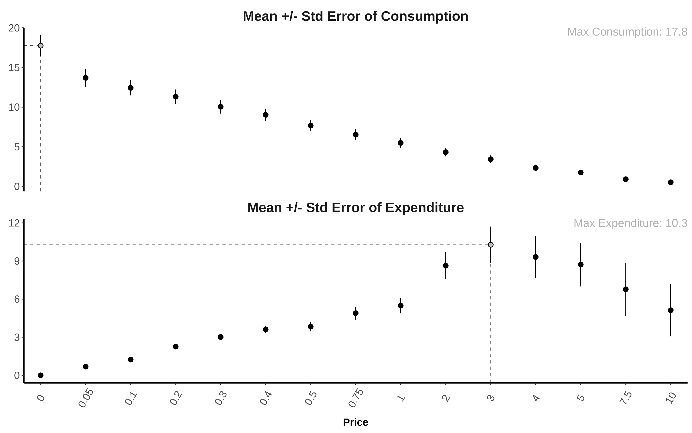
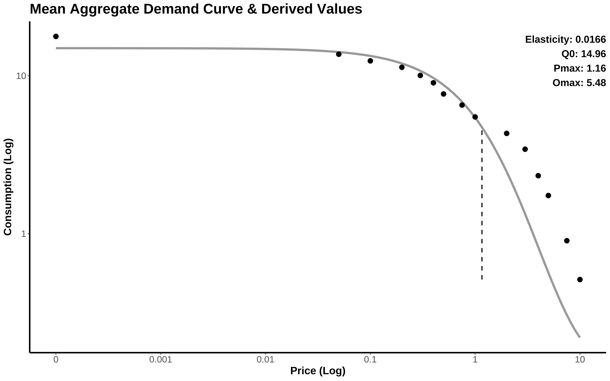
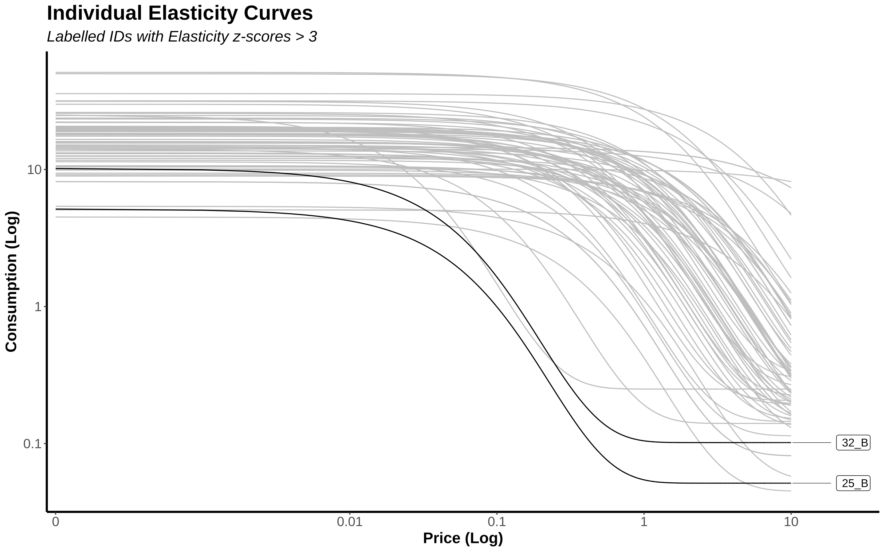
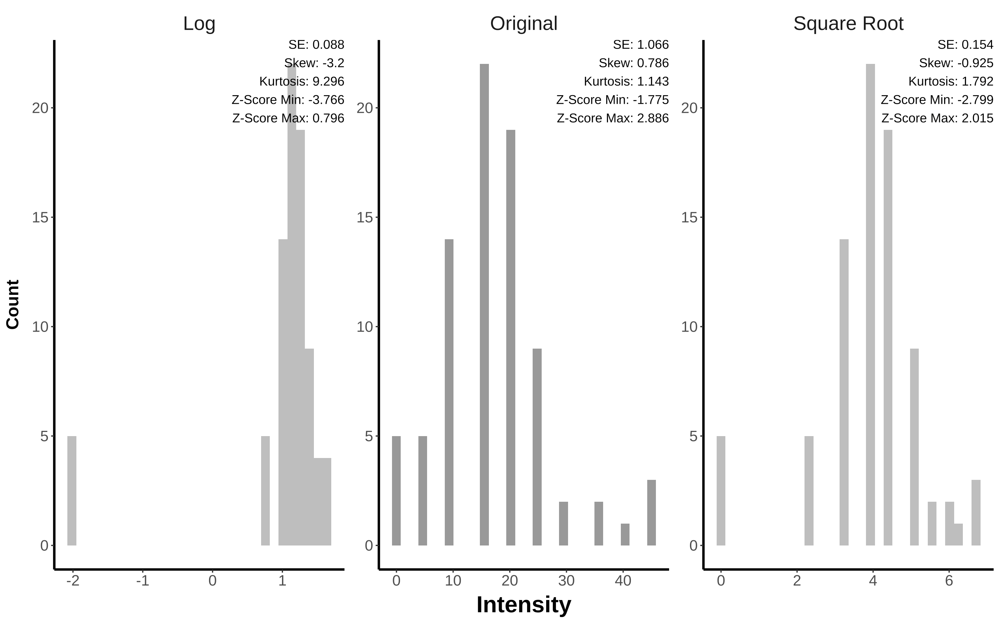

# The {PThelper} Package

This package is designed to walk users through the various steps required to clean and process purchase task data. The benefit of this package is that it provides a standardized framework for processing purchase task data, improving reproducibility.

The {PThelper} package offers 8 different functions for 3 different stages of purchase task processing:

i)  The pre-processing stage of the raw data;

ii)  The calculation of elasticity and derived indicators stage via curve-fitting; and

iii)  The index-level variable management

This package makes use of the wonderful package for processing Behavioral Economic Data by Brent Kaplan (2018) called {[beezdemand](https://github.com/brentkaplan/beezdemand)}. It also makes use of several other packages, including the powerful {ggplot2} for all visualization purposes.

Example Cigarette Purchase Task (CPT) data (`cpt_data`) are provided by this package. Examples using each function on this data set are demonstrated in detail below.

## Installation

To install the {PThelper} package, use the {devtools} package to download directly from this GitHub repository:

```
install.packages("devtools")
devtools::install_github("PBCAR/PThelper")
```

## Introduction to Purchase Tasks

These demand instruments are used to measure the relative reinforcement of a substance - the extent to which a value for a commodity is effected by increased cost. Greater demand (i.e. little sensitivity to changes in price) is often associated with substance-related problems and use disorders (see Bickel et al., 2011). The 5 most commonly used indicators generated from the purchase task are:

Breakpoint -- The first increment of cost with zero consumption

Intensity -- Consumption at zero (or negligible) cost

Omax -- The maximum expenditure

Pmax -- The price associated with the maximum total expenditure

Elasticity -- Measures sensitivity of consumption to increases in cost

## i) Pre-Processing

Purchase task processing requires preparation, and using the `price_prep()`, `pt_prep()`, and `pt_qc()` functions will ensure the proper cleaning of the data prior calculating the purchase task indicators.

The `plot_summary()` function can also be used at the end of the pre-processing stage to visualize the consumption and expenditure across the prices of the purchase task, prior to any outlier management.

The `winsor_price()` function is an optional final pre-processing step which offers different outlier management techniques for the price-level data prior to curve-fitting and other purchase task processing.

#### a) Prices as Variable Names:

To process purchase task data, the variables need to be renamed as the prices they represent. The `price_prep()` function helps users do this within R easily by naming the variables and the equivalent prices.

#### b) Zero-Values on Prices Once Zero-Consumption is Reached:

The `pt_prep()` function assigns zero values to items not administered. Since purchase task items are usually only administered until a consumption of zero is reached (often within an array of prices), missing items need to be assigned zero values for proper processing. The assignment of zero-values is only done for individuals whose final item is a zero-response.

In the case that individuals contradict themselves after giving a response of zero (by giving a non-zero response for the final price of the array), they do not have their responses re-assigned as zeroes. This is because it cannot be assumed that all subsequent responses would also be zeroes.

*NOTE:* Individuals who move through all items without zero consumption reached will still be included, and their breakpoint value will be assigned as the maximum price point of the assessment rounded to the next integer.

#### c) Missing Data Identification:

The `pt_prep()` function will also identify those with missing data by their unique identifier (ID), by printing out the IDs in the console.

#### d) Assign Maximum Consumption Values (Optional):

The `pt_prep()` function gives the user the option to define a maximum value for the purchase task, which re-code values exceeding the `max_val` to the maximum value.

#### e) Quality Control using the 3-Criterion Algorithm:

The `pt_qc()` function helps users to conduct quality control on purchase task data by using the 3-Criterion Algorithm proposed by Stein et al. (2015) to remove non-systematic data. Specifically, this function identifies and removes IDs with:

i) Trend violations -- Those who start with non-zero consumption and do not exhibit a decelerating trend;

ii) Excessive bounce ratios -- Bounce ratios identify inconsistencies in consumption values given. The default bounce ratio is 10%; and

iii) Excessive reversals in responses -- Those who exceed a user-defined number of reversals from a consumption of zero. The default defines a reversal as 2 or more consecutive zeroes and removes those with 2 or more reversals. *NOTE:* This default (used by PBCAR) differs from Stein et al. (2015), who suggest the removal of those with 1 or more reversals.

#### f) Price-Level Winsorization (Optional):

The `winsor_price()` function is used as outlier management at the price level. Outlying values are identified by z-scores higher than the `z_val` or lower than the negative `z_val` as chosen by the user. There are 3 different winsorization types:

i)  Option 1 replaces outliers with the maximum non-outlying price rounded up;

ii) Option 2 replaces outliers with a value 1 unit higher than highest (or 1 unit lower than the lowest) non-outlying value; and

iii) Option 3 replaces outliers with a value 1 unit above the next highest non-outlying value to maintain order

The default z-value used to identify outlying values is 3.99, and the default winsorization type is 'option3'.

## ii) Calculating Elasticity and Derived Values:

To calculate elasticity, a non-linear curve is fit to the price-level data using the `elasticity_curve()` function. This function also provides a diagnostic overview of the sample data curve, as well as individual curves if requested by the user.

#### a) Empircal Purchase Task Indicators:

The empirical values for Intensity, Breakpoint, Omax, and Pmax are processed and retained in this stage.

#### b) Fitting the Curve:

The fit of the elasticity curve by the `elasticity_curve()` function is done using the {beezdemand} package. Either the Hursh & Silberbeg (2008) or the Koffarnus et al. (2015) equation can be used to fit a curve to the data. The default equation is the Koffarnus et al. (2015) equation. By fitting this curve, derived Q0, Omax, and Pmax values are also be calculated.

#### c) Curve Visualization:

The overall sample curve is visualized, with the option to visualize each individual curve on the same plot (known as a spaghetti plot), identifying those with extreme sensitivity to price (i.e. high elasticity values; \> a z-score of 3). *NOTE:* The individual curves visualization can take time to render, especially with large data sets.

## iii) Final Processing of Purchase Task Indicators:

Additional optional processing are available by using the `winsor_index()` and `plot_transform()` functions. These aid with outlier management and management of the distributional shape of the indicator-level purchase task variables.

#### a) Index-Level Winsorization (Optional):

The `winsor_index()` function offers an additional step used to manage outlying data at the indicator-level. It offers the same 3 winsorization types as the price-level winsorization function:

i)  Option 1 replaces outliers with the maximum non-outlying value rounded up;

ii) Option 2 replaces outliers with a value 1 unit higher than highest (or 1 unit lower than the lowest) non-outlying value; and

iii) Option 3 replaces outliers with a value 1 unit above the next highest non-outlying value to maintain order.

*NOTE:* The unit in Option 3 is user-defined via the `delta` argument, with a default value of 0.001.

As with outlier management of the price-level data, the default z-value used to identify outlying values is 3.99, and the default winsorization type is 'option3'.

#### b) Transformation of Purchase Task Variables (Optional):

Optional transformation of index-level variables using the `plot_transform()` function, helps in diagnosing the best transformation to achieve an approximately normal distribution. This function uses the two most common transformations for purchase task indicators, specifically log (log of base 10) and square root due to the distribution often being right-skewed (positively-skewed).

## Example Data (CPT)

The mock data from this package is a Cigarette Purchase Task (CPT) consisting of 15 items in total. The prices range from 'FREE (\$0)' to '\$10' per cigarette. The items are administered to participants in arrays of 3 items. A zero consumption response within an array will end the instrument after the final item within the array.

There are N = 100 participants included in the sample data set, as identified by the unique identifier 'ID'. Most of these participants have CPT data (n = 92), and most are smokers (n = 87).

To import the sample data into the R Environment:

```
library(PThelper)
PT <- cpt_data
```

## i) Pre-Processing

#### The `price_prep()` Function:

First, the variables are renamed to represent their price using the `price_prep()` function:

```
PT <- price_prep(PT, id_var = "ID", vars = c("cpt1","cpt2","cpt3","cpt4","cpt5","cpt6","cpt7", "cpt8","cpt9","cpt10","cpt11","cpt12","cpt13","cpt14","cpt15"),
price = c("0","0.05","0.10","0.20","0.30","0.40","0.50","0.75","1","2","3","4","5","7.5","10"))
```

#### The `pt_prep()` Function:

Next, zero-values are assigned to missing values of arrays not administered for those who reached a consumption of zero using the `pt_prep()` function:

```
PT2 <- pt_prep(PT, id_var = "ID")
```

Those who exit the assessment with a non-zero response will be considered missing alongside those with true missing data on all items, and their IDs will be printed to the console:

```
IDs with Missing Values: 11_A 19_A 22_B 24_B 28_A 30_B 36_A 43_B 46_B 49_A 53_A 66_B 73_B 74_A
```

#### The `pt_qc()` Function:

The quality control measures are then applied to the data using the `pt_qc()` function:

```
PT3 <- pt_qc(PT2, id_var = "ID")
```
Those in violation of any of the 3 quality control measures are removed, and are identified by ID in the console print out:

```
IDs with a trend violation:  2_A 43_A 
IDs with a bounce violation:  59_A 63_A 
IDs with a reversal violation:  NULL 
```

#### The `winsor_price()` Function:

An optional step in pre-processing is outlier management of consumption values. Winsorization at the price level can be completed using the `winsor_price()` function:

```
PT4 <- winsor_price(PT3, id_var = "ID", type = "option3", table = F)
```

The changes made to consumption values are identified by ID and price in the console (or in the 'Viewer' pane if the argument `table` is set to TRUE):

```
|ID   |Price | Original_Value| Winsorized_Value|
|:----|:-----|--------------:|----------------:|
|12_A |10    |             10|                9|
|47_A |10    |             10|                9|
|5_B  |0     |            100|               71|
|5_B  |0.10  |             50|               41|
|5_B  |5     |             15|               11|
|67_B |2     |             25|               21|
```

#### The `plot_summary()` Function:

The end of the pre-processing stage should finish with a visual inspection of both consumption and expenditure across the prices of the purchase task. This can be achieved using the `plot_summary()` function:

```
plot_summary(PT3, id_var = "ID")
```

The visualization is printed to the 'Plots' pane:



## ii) Calculating Elasticity and Derived Values:

Calculating the elasticity curve is achieved using the `elasticity_curve()` function:

```
PT5 <- elasticity_curve(PT4, id_var = "ID")
```

The best fitting k-value is identified in the console printout. Additionally, IDs with changes to Breakpoint values (who had more than 1 zero consumption value) are identified, alongside the IDs which could not have an elasticity value calculated due to having a consumption value of zero in the first and/ or second item of the purchase task:

```
Selected k-value:  2 
IDs with changes to Breakpoint:  10_B 14_A 38_B 45_A 53_B 7_B 
IDs with a zero consumption value in the first and/ or second price:  10_A 15_A 20_A 21_A 32_A 54_A 57_A 59_B 63_B 69_A 71_A 
```

An overall curve of the entire sample is provided with this function, which is printed to the 'Plots' pane:




#### If `id_curve` is set to TRUE:


The option to visualize each individual curve on the same plot (known as a spaghetti plot) is provided by the logical argument of `id_curve`. It is used to identify those with extreme sensitivity to price (i.e. high elasticity values \> a z-score of 3):

```
PT5 <- elasticity_curve(PT4, id_var = "ID", id_curve = T)
```

The printout to the console is the same as when `id_curve = FALSE`, however, it will also identify IDs with extreme price sensitivity (defined as those with z-score values greater than 3):

```
IDs with extreme price sensitivity (Elasticity values > z-score of 3):  25_B 32_B 
```

The console printout will also prompt the user to "Hit \<Return> to see next plot:", which will allow them to see the individual elasticity curves plot after the overall sample curve is printed to the 'Plots' pane:



## iii) Final Processing of Purchase Task Indicators:

#### The `winsor_index()` Function:

All, none, or some of the index-level variables can undergo winsorization to manage outlying values. Below, the `winsor_index()` function is used to manage outlying values of Intensity:

```
PT6 <- winsor_index(PT6, id_var = "ID", index_var = "Intensity", type = "option3")
```

Changes made to the chosen indicator variable are identified by ID in the console (or in the 'Viewer' pane if the argument `table` is set to TRUE):

```
|ID   | Old Intensity| New Intensity|
|:----|-------------:|-------------:|
|31_B |            70|        45.001|
|5_B  |            71|        45.002|
```

#### The `plot_transform()` Function:

This function provides summary statistics as well as a visualization of distribution of the original variable, alongside two transformations (log10 and square root):
```
plot_transform(PT6, pt_var = "Intensity")
```

The visualization is printed to the 'Plots' pane:



## References

Bickel, Warren K, David P Jarmolowicz, E Terry Mueller, and Kirstin M Gatchalian. (2011). "The Behavioral Economics and Neuroeconomics of Reinforcer Pathologies: Implications for Etiology and Treatment of Addiction." Current Psychiatry Reports 13 (5): 406--15.

Hursh, S. R., & Silberberg, A. (2008). Economic demand and essential value. Psychological Review, 115 (1), 186-198. <http://dx.doi.org/10.1037/0033-295X.115.1.186>

Kaplan, Brent. (2018). Beezdemand: Behavioral Economic Easy Demand.

Koffarnus, M. N., Franck, C. T., Stein, J. S., & Bickel, W. K. (2015). A modified exponential behavioral economic demand model to better describe consumption data. Experimental and Clinical Psychopharmacology, 23 (6), 504-512. <http://dx.doi.org/10.1037/pha0000045>

Stein, J. S., Koffarnus, M. N., Snider, S. E., Quisenberry, A. J., & Bickel, W. K. (2015). Identification and management of nonsystematic purchase task data: Toward best practice. Experimental and clinical psychopharmacology, 23(5), 377.
